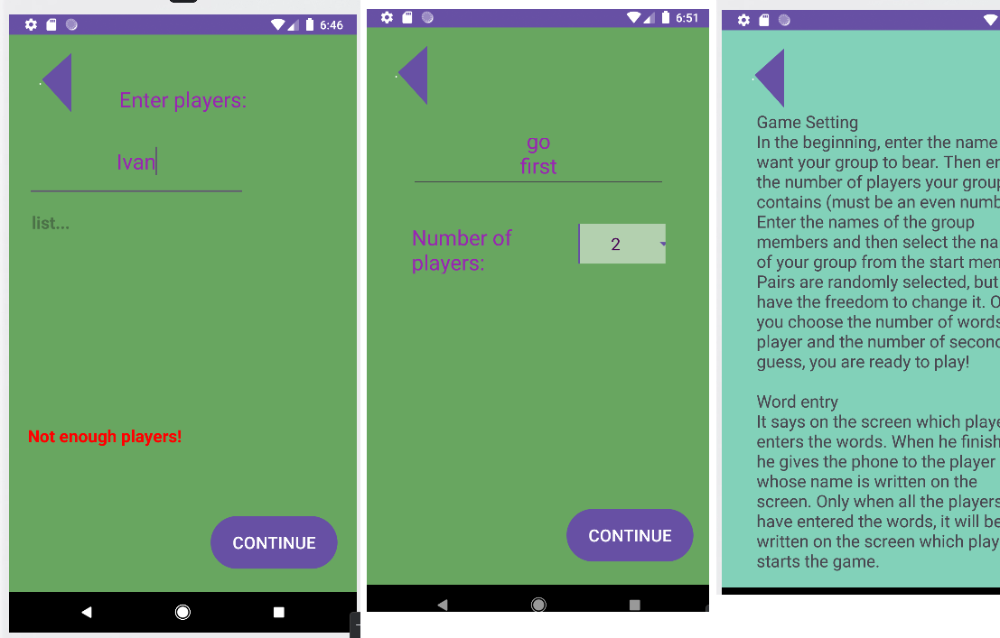

# Asociacii

# About application

Android application to play the game "Associations in 3 phases"

## Technologies used

The application was made in programming language [Kotlin](https://kotlinlang.org/), in the environment [Android Studio](https://developer.android.com/studio).

## Game description

**Setting up the game**

Enter the number of groups, then enter a name you want your group to bear. Enter the names of the group members and then select the name of your group on the home menu. The number of words per player that can be dodged and the number of seconds to guess, are options.

**Entering words**

There is a contained called "Dictionary" and it contains words that can be added or removed before the game starts.

**Phases**

Phases change when all of the words are guessed. Each player can dodge subject number of times specified beforehand.

*Phase One (Free explanation)* - The explaining player can talk to their partner as much as they want about the concept on the screen.

*Phase Two (One word)* - The explaining player may only use one word when explaining, after which he does not say anything until his partner guesses the concept on the screen.

*Phase Three (Theatrics)* - The explaining player tries to explain the given concept to the partner using gestures.

**Game ending**

After the third phase, the guessed words are added up in pairs and the pair with the most guesses wins.

### Author
Kiril Kostov f101519